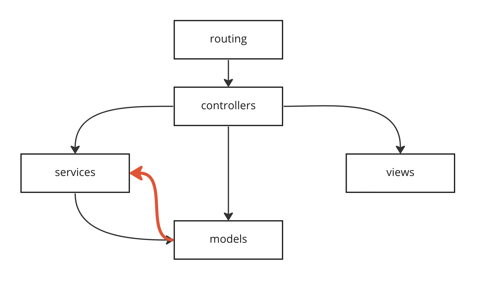

# [ADR-1] Требования к service-object в Ruby-проектах

| | |
| --- | --- |
| **Дата** | 01.12.20XX |
| **Составил** | Игорь Симдянов (Архитектор) |
| **Статус** | принят |
| **Тэги** | Arch, Ruby |
| **Причина отмены** | |
| **Замещен на** | |

| | |
| --- | --- |
| **Резюме** | **Service-объекты** — классы в Ruby-приложениях, предназначенные для описания слоя бизнес-логики. Так как реализация фич и модификация бизнес-логики является основной нашей деятельностью, этот участок в Ruby-приложениях подвергается изменениям чаще всего. RFC фиксирует договоренности и требования к таким классам. |
| **Проблема** | Фреймворк Ruby on Rails строится на основе паттерна MVC, поэтому в нем детально прописываются требования к контроллерам (C), моделям (M) и представлениям (V). В то же время слой бизнес-логики никак не регламентируется. Поэтому сервис-объекты оформляются по произвольным правилам. Хорошо бы договориться в Ruby-командах, что допустимо использовать в service-объектах, а что нет. Хорошее введение в проблематику можно найти у Антона Давыдова в выступлении на RubyRussia [https://www.youtube.com/watch?v=DfU6H-8qal8](https://www.youtube.com/watch?v=DfU6H-8qal8) |
| **Описание** | **Архитектурные слои** Код в приложении можно разделить на архитектурные слои. Мы можем обращаться к компонентам внутри слоя и компонентам подчиненных слоев.    Например, мы можем из контроллеров обращаться к моделям и сервисам. Сервисы-объекты могут обращаться к моделям. Но в моделях мы не используем сервис-объекты: это признак того, что мы пытаемся реализовать бизнес-логику в моделях (она должна быть в сервисах).  **Мы используем тонкие модели** Модели и контроллеры в MVC предназначены для разделения реализации и представления результатов. Мы не должны реализовывать бизнес-логику в классах моделей. Это означает, что там по возможности не должно быть лишних методов. Эти методы не должны что-то сериализовывать, или что-то вычислять, или связываться с другой моделью в обход ассоциаций или пытаться валидировать сразу несколько моделей. Как только мы это делаем, мы покрываем какой-то один случай (в личном кабинете, админке, фоновом задании). При этом моделью, как источником данных из базы данных будут пользоваться все. Всем остальным придется подстраиваться под уже реализованные методы. Плюс появляется соблазн насоздавать своих методов.Не храним бизнес-логику в модели.  **Мы используем тонкие контроллеры**  Идеально если контроллер помещается на одном экране и состоит только из коротких экшенов. Если есть возможность обойтись без колбэков - обходимся без них. В private-области мы реализуем только permit-методы, методы для колбэков (но лучше если бы их было поменьше или не было бы вообще).  В каждой папке стоит иметь Base-контроллер, чтобы наследовать контроллеры от него. В качестве примера ориентируемся на API::User::Requests::FreezeRequestsController, который наследуется от API::User::Requests::BaseController. Последний в свою очередь наследуется от базового контроллера API::BaseController.  **Бизнес-логика** В текущем монолитном решении netology\_rails сервис-объекты описывают бизнес-логику и располагаются в папке app/services и ряде других папок, описанных ниже. Ряд сервис-объектов являются специализированными: например Policy-объекты, предназначенные для управления авторизацией.  **Точка входа сервис-объекта** 1. Сервис-объект представляет собой класс, логика которого реализуется в инстанс-методах. 2. У сервис-объекта может быть только одна точка входа: call. Метод perform используется только для ActiveJob-классов. 3. Голоса разделились как инициализировать сервис-объекты: большинство высказалось за вариант  Services::Users::MaxEvents.call(params)  однако допускаются альтернативы:  Services::Users::MaxEvents.new.call(params) Services::Users::MaxEvents.new(options).call(params) Services::Users::MaxEvents.new(params).call  4. Метод для точки входа объявляется открытым — все остальные методы: закрытыми. По возможности разделяем сервис-объекты для операций и хранения состояний. Первые не дают внешний доступ к instance-полям сервисного объекта (@var), вторые возвращают Result-объекты, для возврата состояния из сервис-объекта с операциями. Для Result-объектов допускается множество точек входа.  **Модуль Callable** Основной способ организации обращения к сервис-объектам реализован через метод класса:  Services::Users::MaxEvents.call(params)  Это не единственный способ, но самый распространенный. Так как он используется в каждом втором сервис-объекте, для его поддержки реализован специальный модуль Callable, который подмешивается в сервис-объект.  **Расположение** Сервис-объекты располагаются в нескольких папках:<ul><li>app/services — основной массив сервис-объектов</li><li>app/authorizers — policy-объекты для авторизации в админке</li><li>app/policies — policy-объекты для авторизации в личном кабинете</li><li>app/decorators — декораторы, разгружаем модели логикой типа: "#{first\_name} #{last\_name}"</li><li>app/domain — чистилище для engine-изоляции доменных областей, здесь собираются кандидаты для отдельных сервисов</li><li>app/forms — form-объекты</li><li>app/queries — query-объекты</li><li>app/repositories — repositories-объекты</li><li>app/serializers — сериалайзеры (классы для подготовки JSON-представления моделей)</li><li>app/state\_machines — стейт-машины</li><li>app/validators — валидация, охватывающие несколько моделей</li><li>app/uploaders — загрузчики файлов</li></ul>Мы избавляемся от следующих папок:<ul><li>app/repositories — repositories-объекты</li><li>app/state\_machines — стейт-машины</li></ul>Папка app/state\_machines переносится в app/models/state\_machines, чтобы файлы, которые относятся к слою моделей находились в одной папке app/models.Не заводим в них новые файлы и если ваша задача затрагивает одну из этих файлов, переносите оттуда функционал в модели. Если стейт-машина очень объемная, то допускается выносить ее в concern, который располагается в подпапке, имя которой совпадает с моделью. Мы не переиспользуем стейт.машины в нескольких моделях. Вместо репозиториев по возможности используем scope в моделях и query-объектах.  **О чистом SQL** При реализации сложной бизнес-логики, иногда трудно обойтись ORM. Отточенный годами SQL позволяет выразить мысль точнее и нагляднее. У чистого SQL есть недостатки: трудно сопровождать и пересаживаться на альтернативную базу данных. Мы эти недостатки принимаем и договариваемся, что допускается использование чистого SQL, но в моделях и query-объектах. Если вам нужен SQL-запрос где-то в сервисе - лучше создать query-объект и использовать его. Это позволит локализовать SQL в одном архитектурном слое и облегчит последующее сопровождение и рефакторинг.  **Выделение изолированных областей в монолите** При подготовке к выделению доменной области из монолитной части, она помещается в папку domains, которая строится по принципам “кричащей архитектуры”. Что это?Бизнес-логика меняется чаще, чем весь остальной код. У нас быстрее поменяется организации курсов/вебинаров/вариантов оплат, чем фреймворк Ruby on Rails. Поэтому бизнес-логику мы изолируем от остального кода. Проще изменять и удалять, не задевая инфраструктурный код, который живет годами. У бизнеса есть разные контексты или домены: финансы, образование, успеваемость, и т.п. В этих доменах и сосредотачивается 90% задач, которые сыпятся на нас от бизнеса. Было бы здорово, чтобы можно было легко находить весь код связанный с доменом, чтобы код как бы “кричал”: финансы у нас живут тут - “app/domains/finance”, можно не искать куски логики где-то еще. Внутри этого домена можно использовать подпапки operations для операций, models для моделей, jobs для обработчика очередей и services для остальных сервис-объектов. Но лучше ориентироваться на бизнес-составляющие:  app/domains/finance/tinkoff app/domains/finance/yandex-kassa app/domains/finance/rick-ai  Чтобы можно было быстро найти именно бизнес-составляющие.  **Предложения: что хотим изменить?** 1. Несмотря на то, что мы по возможности используем чистые классы Ruby и не налегаем на интеракторы и dry-rb, некоторые библиотеки dry-rb кажутся очень привлекательными и удобными. В частности многим в команде нравятся dry-validation, dry-initializer и dry-monad. Их использование запланировали осветить в одном из дальнейшем RFC. Однако жесткого запрета на их использование прямо сейчас нет. 2. У нас беда с сериалайзерами и работа с ними никак не регламентирована. Под них так же будет выпущен отдельный RFC. 3. Не используем интеракторы, а уже существующие объявляем устаревшими и стараемся при рефакторинге разобрать. |
| **Недостатки** | |
| **Альтернативы** | В Ruby-сообществе эта проблема стоит довольно остро, поэтому было реализовано несколько подходов для организации сервис-объектов:<ul><li>dry-rb</li><li>interactor</li><li>trailblazer</li></ul> |
| **История вопроса** | В netology\_rails есть папка interactors в которой уже реализованы интеракторы и есть папка domains, в которой изолирована подсистема HelpDesk |
| **Вопросы на обсуждение** | **Требования к сервис объектам:** 1. У нас точка входа для некоторых сервис-объектов perform, для некоторых call - давай выберем одну, потому что иначе не работает унифицированный способ создания классововго варианта - модуль Callable. 2. Где стоит хранить модуль Callable? 3. У нас на проекте есть интеракторы, мы должны либо всю бизнес-логику туда переносить, либо новую, либо текущую демонтировать? 4. У нас затащен почти весь dry-rb, но мы его не используем для своих сервис-объектов. Мы хотим его использовать или хотим использовать чистые Ruby-классы? 5. Должны ли мы детальнее описать в RFC использование FormObject? 6. Должны ли мы детальнее описать в RFC использование Policy-объектов? 7. Должны ли мы детальнее описать Query-объекты? 8. Должны ли мы детальнее описать Repositories? 9. Будем ли тут затрагивать сериалайзеры? или отдельно их обсудим (отдельный RFC)? 10. Должны ли мы детальнее описать state\_machine? 11. Должны ли мы группировать внутри папок с service-объектами подпапки и файлы относящиеся к одной доменной области в одну подпапку? 12. Следует ли нам добавлять модели, не соответствующие таблицам в БД, для инкапсуляции знаний о предметной области? 13. Нейминг синхронного вызова кода и асинхронного вызова одинаковы?  **Организация приложения:** 1. Интенсивнее использоваться Dry (валидации, контейнеры, DI). Возможно определить порядок его использования отдельным RFC? 2. Вынос логики использования AcriveRecord в query-объекты и repositories. 3. Запрет на использование сервис-объектов в моделях. 4. Запрет на использование обращений к базам данных и классам моделей из декораторов. 5. Хотим ли распиливать монолит на отдельные домены, возможно и использованием engine-ов? Отдельный RFC под эту тему? 6. Использование чистого SQL в сервис-объектах? Это нормально или мы хотим только ActiveRecord и Arel? |
| **Затрагиваемые сервисы** | Ruby-разработчики всех команд |
| **Кто голосует?** | Ruby-разработчики |
| **Способ утверждения** | Большинство Ruby-разработчиков, не менее 5 голосов ЗА, 5 голосов ПРОТИВ отменяет принятие ADR (RFC останется для истории) |
| **Комментарии** | Вопросы и предложения были обсуждены на встрече 13.12.20XX backend-встреча "Обсуждение/голосование за положения RFC-1". По результатам рассмотрели и проголосовали на miro-доске Изменения были внесены в текст RFC-1. |
| **Собрания** | 29.11.20xx backend-встреча "Требования к сервис-объектам. Dry-rb, интеракторы, оформление" 13.12.20XX backend-встреча "Обсуждение/голосование за положения RFC-1" 21.12.20XX принято в качестве ADR-большинством голосов |

| | |
| --- | --- |
| **За** | **Против** |
| Участник1 | Участник2 |
| Участник3 | |
| Участник4 | |
| Участник5 | |
| Участник6 | |
| Участник7 | |
